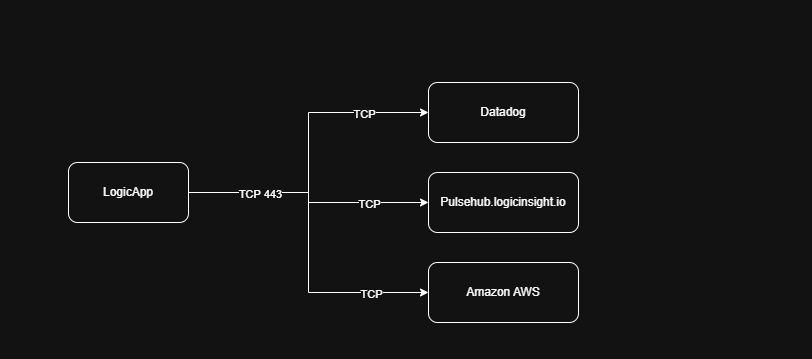

# 
Logic Insight Appliance Port Breakdown

| Port(s)           | Protocol  | Source                                       | Destination                                   | Service   | Description |
|------------------|----------|--------------------------------|--------------------------------|----------|-------------|
| 443            | TCP      | LogicApp                 | Pulsehub Logic Insight                 | License    | License verification  |
| 9440            | TCP      | LogicApp                | Nutanix Prism Central                | Prism Central Wizard | TCP Communication with Prism Central to add Prism Element Clusters |
| 9440            | TCP      | LogicApp                | Nutanix Prism Element                | Nutanix Prism Element Collector | SSL communication between LogicApp and Prism Element APIs. |
| 443            | TCP      | LogicApp                | Datadog                | Datadog Communication | SSL communication between LogicApp and Datadog Data Ingestion API. |
| 443            | TCP      | LogicApp | AWS | Update Server | Default port where the LogicApp is able to get updates. https://logicappupdate.s3.us-east-1.amazonaws.com |
|

# 
Port Diagram

